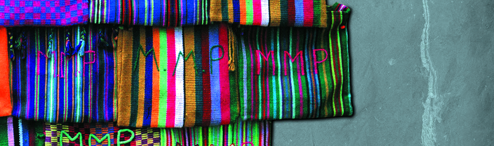

## GEG 390 / APY 418 and APY 611 / INS 301 / LAS 320
## [Indigenous Cartographies and Cartographies of the Indigenous (3 units)](https://github.com/tibbben/indigenous-cartography)  

### Land Acknowledgement  
This course originates from the University of Miami and takes place on the Coral Gables campus in greater Miami, Florida. We acknowledge the ancestral and traditional territories of the Tequesta peoples, the Seminole Tribe of Florida, the Council of the Original Miccosukee and Simanolee Nation Aboriginal Peoples, and the Miccosukee Tribe of the Indians of Florida who are the original owners and custodians of the land upon which we stand and learn. This acknowledgment is one of the ways in which we work to educate ourselves about this land, its history, and our relationships with the land and each other.

### Instructor:  
Instructor: Timothy Norris, Ph.D.  
email: [tnorris@miami.edu](tnorris@miami.edu)  
Office Hours: TBD  

### Meetings:   
TuTh 2:00 - 3:15 pm  
Dooly Memorial 115  
01/17/2023 - 05/01/2023

### Course Description:  
"More Indigenous territory has been claimed by maps than by guns." (Nietschmann 1995). Whether true or not, this statement underlines the importance of understanding how cartographic practices and performances form a part of the historical and contemporary Indigenous experience. This course combines thinking from the disciplines of geography, history, anthropology, and the history of science to explore map making through ancestral, Indigenous, colonial, anti-colonial, and de-colonial lenses within a global scope with an emphasis on the Americas. Inquiry will focus on how maps are used as tools to claim power, territory, sovereignty, and identity, and how they are leveraged for conservation and natural resource management on Indigenous territory. Learning will be based on reading literary and map texts, discussions, excursions to the University of Miami Libraries’ Special Collections and the Lowe are Museum, and a (potential) field trip. By the end of the semester students will understand how Indigenous geographies intermingle with western/European cartographic traditions by tracing the distinct histories of practice and then examining how they have come together in the past and continue to do so in the present. Apart from reading maps, students explore various mapping technologies from manual hand drawn or narrative traditions to digital mapping platforms such as ESRI’s Storymap suite.

Nietschmann, Bernard. (1995). Defending the Miskito Reefs with Maps and GPS: Mapping with Sail, Scuba, and Satellite. *Cultural Survival Quarterly*, 18(4), 34-37.  
 
### Texts and Materials:  
The course will draw from a broad set of texts and maps as secondary sources and from selected items held in the UM Libraries Special Collections and the Lowe Art Museum as primary sources. The principal texts used in the course include (purchasing one or several of these titles is recommended but not required):

-   Warhus, Mark. (1997). *Another America: Native American Maps and the History of Our Land.* New York: St. Martin’s Press.
-   Cole, Daniel G., & Sutton, Imre (Eds.). (2014). *Mapping native America : cartographic interactions between Indigenous peoples, government, and academia* (Vols. 1, 2 and 3). North Charleston: CreateSpace Independent Publishing Platform.
-   Hidalgo, Alex. (2019). *Trail of Footprints: A History of Indigenous Maps from Viceregal Mexico.* Austin: University of Texas Press.
-   Taylor, Anne, Gadsen, David, Kerski, Joseph J., & Guglielmo, Heather (Eds.). (2012). Tribal GIS: Supporting Native American Decision Making. Redlands, CA: ESRI Press.

Note that all secondary text/map materials will be made available through the University of Miami Libraries course reserves or will be posted online using Blackboard in the course documents section. 

### Measurable Learning Outcomes:  
Upon completion of the course the students will be able to:  

1.  Discuss the history of ancestral, imperial, and colonial cartographic practices in the context of Indigenous territories and homelands.  
2.  Describe the cartographic process and the roles that Indigenous people assume in this process including, but not limited to, creators, participants, and informants.  
3.  Describe basic components and processes in 'western' Cartesian cartography and modern geographic information systems (GIS).
4.  Discuss how map making informs the creation and destruction of property rights and Indigenous rights. 
5.  Discuss known difficulties when Indigenous knowledge systems are combined with Cartesian cartography and GIS.
6.  Describe historic encounters between Indigenous peoples and cartographic practice.
7.  Describe participatory mapping, land occupancy mapping, and counter-mapping in the context of Indigenous experience.
8.  Discuss mapping of Indigenous territories in the context of natural resource management and nature conservation.
9.  Evaluate similarities and differences between geographically distinct encounters of Indigenous peoples with cartographic enterprises.  
10.  Evaluate positionality of cartographers that author maps with content related to Indigenous groups, including a self-evaluation of positionality in student projects.  

### Course Resources:
All course information and materials will be posted to the [Blackboard Site](#).

### Blackboard, e-mail, and data management:
It is essential that you maintain your UM e-mail account because notifications in Blackboard will be used to communicate with the class. You should ensure that your account neither rejects my e-mail nor exceeds your assigned storage quota. You should also backup all of your work: there is simply no excuse for losing your work due to “computer issues” (which are really “human issues”). If you have questions, ask your instructor. 

### Methods of Instruction:  
Lecture, reading discussion, in class demonstration, and practical out-of-class and in-class assignments.

### Prerequisites
There are no formal prerequisites for this course. Specifically there is no pre-requisite for knowledge of geographic information systems (GIS) or cartography. On the other hand, students are expected to perform self-directed research based on primary and secondary sources of information.

---
